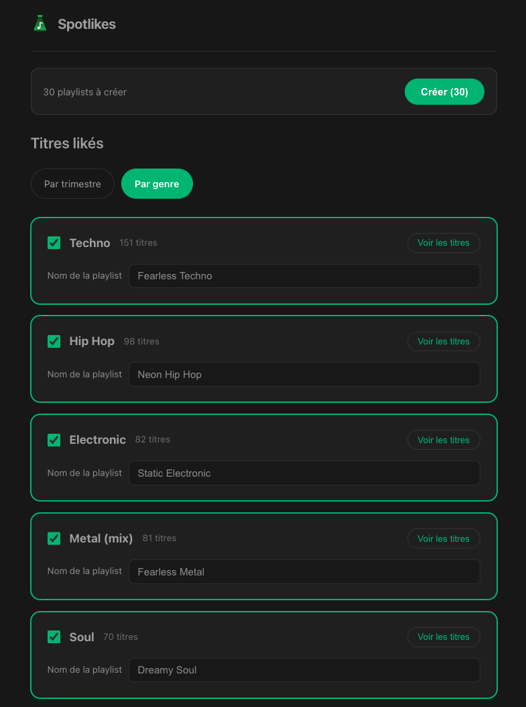

<p align="center">
  
</p>

<h1 align="center">Spotlikes</h1>

Spotlikes is a small web app that helps you make sense of your liked tracks on Spotify. It fetches them, automatically groups them **by year** or **by broad music family** (Rock, Electro, Hip-Hop, Jazz...), lets you fine-tune the selection, then creates a private playlist per group in one click — complete with an auto-generated name and cover.

No backend involved: the app talks directly to the Spotify API from the browser (OAuth Authorization Code with PKCE), and nothing is ever persisted to disk — no token, no personal data.

## Features

- **Secure Spotify login** (PKCE, no secret exposed on the client).
- **Fetches all liked tracks**, with automatic pagination.
- **Two grouping modes**:
  - **By year** (date added to favorites).
  - **By genre**, classified into about a dozen broad music families (Rock, Electro, Hip-Hop, Metal, Soul, Jazz, Blues, Pop, Chill, Disco, World, Country, Latin, Reggae), with small families automatically merged into a bigger one.
- **Preview before creating anything**: rename a playlist, exclude individual tracks, play an audio preview, check/uncheck group by group (or select/deselect all).
- **Smart default selection**: only groups with more than 20 tracks are checked automatically.
- **Creates private playlists** on Spotify, with:
  - a name generated from the music style (e.g. _"Amplified Rock"_, _"Smoky Jazz"_) or the year,
  - an auto-generated cover, visually distinct per mode (colorful vinyl for genres, blue-toned calendar for years).
- Prevents re-creating a playlist already generated in the current session.

## Screenshots



## Tech stack

- Vue 3 (Composition API, `<script setup>`) + TypeScript
- Pinia for state management
- Vite as the build tool
- Vitest for unit tests
- Spotify Web API (OAuth PKCE) + Last.fm API (genre data)

## Spotify setup (one-time)

1. Create an app on the [Spotify developer dashboard](https://developer.spotify.com/dashboard).
2. Note the **Client ID**.
3. In the app settings, add exactly this Redirect URI: `http://127.0.0.1:5173/callback`.
   (Spotify no longer allows `localhost` over HTTP, you need the explicit loopback address `127.0.0.1`.)
4. Copy `.env.example` to `.env.local` (already done in this repo, `.env.local` is gitignored) and fill in:
   ```
   VITE_SPOTIFY_CLIENT_ID=<your_client_id>
   ```

No secret is needed: authentication uses OAuth Authorization Code with PKCE, directly from the frontend.

## Last.fm setup (for genre grouping)

Spotify restricts access to genre data for apps in Development Mode (very low quota). Genre is therefore fetched via Last.fm's public API (`artist.getTopTags`), by artist name.

1. Create a free API key at https://www.last.fm/api/account/create (just an app name to provide).
2. Add it to `.env.local`:
   ```
   VITE_LASTFM_API_KEY=<your_key>
   ```

Without this key, "By genre" mode won't work; "By year" remains fully usable.

Fetched genres are cached in the browser's `localStorage` (by artist name), to avoid re-querying Last.fm every session for an artist already looked up.

## Install

```sh
npm install
```

## Development

```sh
npm run dev
```

Open `http://127.0.0.1:5173` (not `localhost`, to match the Redirect URI declared on the Spotify side), click "Se connecter à Spotify", pick a grouping mode (year or genre), adjust playlist names and excluded tracks if needed, then create the selected playlists.

**Note**: the access token is never persisted (neither to disk nor to storage) — it only lives in memory for the duration of the session. Reloading the page requires logging in again.

## Unit tests

```sh
npm run test:unit
```

## Quality checks

```sh
npm run type-check
npm run lint
npm run format
```

## Production build

```sh
npm run build
```
